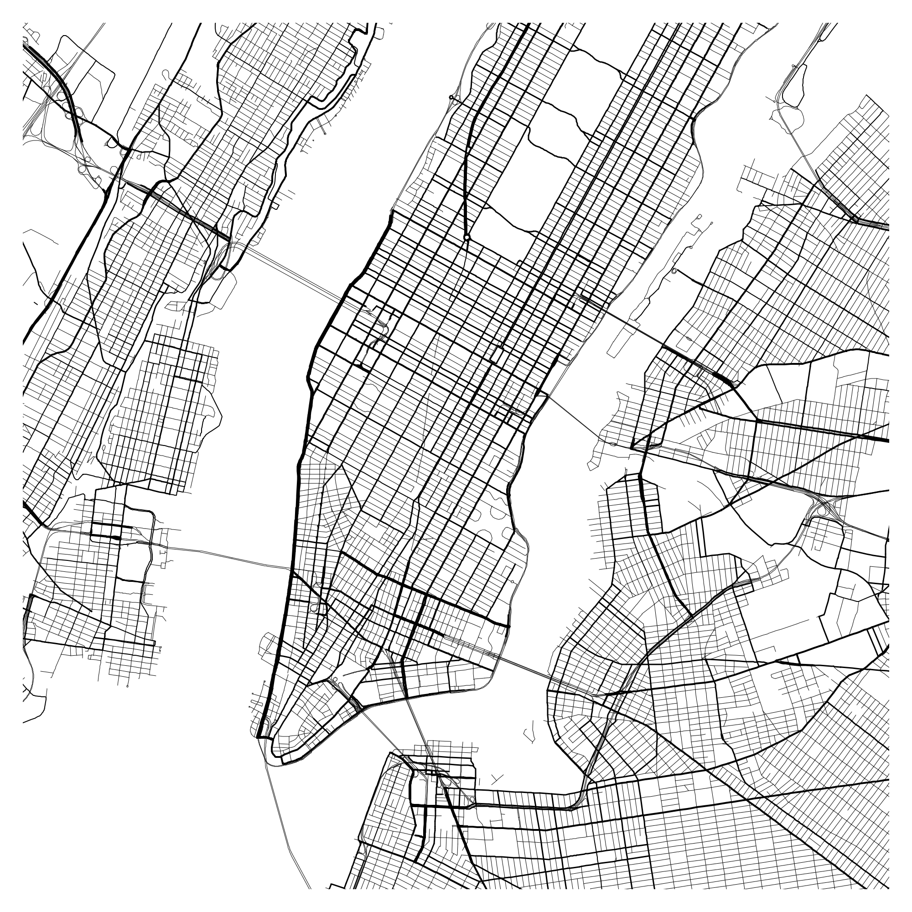

pybeautymaps
============

.. image:: https://travis-ci.org/pfaion/pybeautymaps.svg?branch=master
    :target: https://travis-ci.org/pfaion/pybeautymaps

.. image:: https://coveralls.io/repos/github/pfaion/pybeautymaps/badge.svg?branch=master
    :target: https://coveralls.io/github/pfaion/pybeautymaps?branch=master

This is a library for creating beautyful map images with python.

Installation
------------
.. code-block:: bash

    pip install git+https://github.com/pfaion/pybeautymaps

Quick-Start
-----------
Take a look at the `examples <examples>`_ folder for different renderings.

.. code-block:: python

    from pybeautymaps import Beautymap

    m = Beautymap.square_centered(
        center_latlon=(40.757667, -73.983715),
        width=8.0
    )

    m.render_square_png('manhattan.png', size=2000, padding=50,
        line_widths={
            'trunk': 5,
            'primary': 4,
            'secondary': 3,
            'tertiary': 2,
        }
    )
